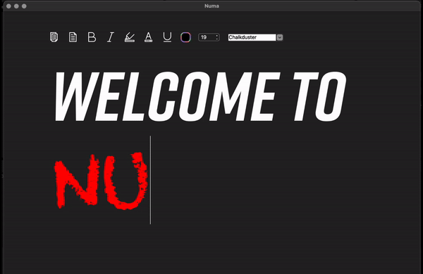

# Numa 

Numa is a lightweight desktop document-style text editor designed for universal editing. It supports custom project files, enabling freedom beyond plain text. 


## Visuals




## Installation

To get started with Numa, follow these steps:

### Prerequisites
- Install [CMake](https://cmake.org/download/).
- Install [Qt 6.7.0 or higher](https://www.qt.io/download).

### Setting Up the Project
1. **Clone the Repository**
   
   ```bash
   git clone https://github.com/AlessandroBor/Numa.git
   cd Numa

2. **Configure with CMake**
- Open Qt Creator, load the project by navigating to the CMakeLists.txt in the cloned directory.
- Ensure to specify the Qt source files as required:
  - Go to Projects > Manage Kits > Edit > Qt Versions > Add and navigate to your Qt installation.
  - Set the CMAKE_PREFIX_PATH to point to your Qt installation, usually something like:
 
     ```bash
    /Users/yourname/Qt/6.7.0/macos/lib/cmake

3. **Build the Project:**
- Build the project by clicking the 'Build All' button in Qt Creator or using the following command in the terminal:
  
   ```bash
      cmake --build . --config Release
  
**Run the Application**

- Run the application directly from Qt Creator or find the executable in the build directory.

## Download the App

If you prefer not to build from source, you can download the latest 
release from the Releases page on GitHub.

## Usage
Launch Numa and open or create a document to start editing. The interface is designed to be intuitive for those familiar with desktop publishing and text editing software.

## License
This project is published under the Creative Commons Zero (CC0) license. However, it is important to point out that each asset/sprite/sound used in this project has its own licence, and thus, they are displayed at the credits section, so that everything that was used can be checked.
